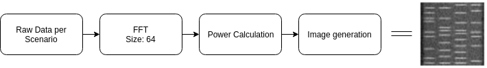
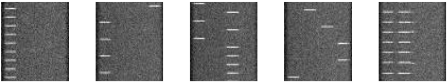
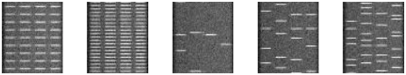

# Machine Learning Engineer Nanodegree
## Capstone Proposal
Nicolas Cuervo
December 28th, 2018

## Proposal
Spectrum Occupancy classification for cognitive radio

### Domain Background
In the last decades, access to the electromagnetic spectrum has been granted to the highest bidder on _spectrum auctions_, whose winner is entitled to use this resource in the best suitable way for its own available technology and to obtain profit from it. Generally, these _temporary owners_ of the spectrum have a chunk, or definite bandwidth, of the spectrum that they manage, without regard of how is this chunk subdivided or when specifically this chunk is used. This leads to service providers to have a suboptimal use of this bandwidth, leaving time and frequency gaps between effective usage of it.

With an increasing demand of the spectrum given by the accelerated increment on the number of devices accesing it, it is imperative to find ways that allow a more effective use of this natural resource, such as using the bandwidth in every single available frequency sub-band (as long as it does not interfere with the neighbor frequencies), or accessing the spectrum during the times other users are idle. This is known as **spectrum sharing**, and has been under research lately because it is one of the main concepts to be applied as part of the 5th generation of communication systems, as well as mitigating spectrum scarcity. During the last year of my masters program at the _Karlsruhe Institute of Technology_ while being a research assistant at the _Communications Engineering Lab (CEL)_, we investigated this while also taking part of two successive competitions organized by the _Communications Society_ of the _Institute of Electrical and Electronics Engineers_ (ComSoc - IEEE), called "Spectrum Challenge", which is an event that takes place during the _International Symposium on Dynamic Spectrum Access Networks - Dyspan_. We came out as _Subjective Winners_ on [2015](https://dyspan2015.ieee-dyspan.org/content/5g-spectrum-sharing-challenge-0)[1] and _Best Overall Solution_ on [2017](https://dyspan2017.ieee-dyspan.org/content/award-winners)[2]. However, we noticed that we were still lacking on the _spectrum awareness_ capabilities of our implementation.

That is the reason why I took part of this nanodegree program: to understand the techniques and concepts of artificial intelligence, and apply them to my research in Cognitive Radio, and so achieve a better spectrum awareness and a better overall implementation for spectrum challenge, and an effective mitigation of the spectrum scarcity.

### Problem Statement

This work intends to use the same set up used in the Dypan Spectrum challenge 2017 as base testbed, which can be seen in the picture below:

**Fig 1:** Hardware setup and description of the [DySpan Spectrum Challenge 2017](https://dyspan2017.ieee-dyspan.org/) [3]

This utilices a couple of devices known as _Universal Software Radio Peripherals - USRP_ manufactured by the company [Ettus Research](www.ettus.com) [4], which are devices that allow various parametrizable implementation of communication systems. As it can be seen in Fig. 1, there is a so-called PU, which stands for _Primary User_, which is a device that is accessing the spectrum with the highest priority, and resembles a service provider with all the rights to use the given bandwidth. The objective of the challenge is to implement a so-called _Secundary user - SU_, that shares the same resources and accesses the spectrum effectively, i.e. pushes the maximum possible throughput between its transmitter and receiver, while having minimum or non-existent interference with the PU. In order to achieve this, the SU requires a complete situation awareness in order to identify how the PU is accessing the spectrum, and should learn these behavior and react accordingly. This is the main scope of this project.

For the purposes of the challenge, the PU maintains a transmission between its transmitter and receiver that follows certain characteristics. These are:

* Bandwidth and carrier frequency: all transmissions are contained in a 10MHz maximum bandwidth divided into four subchannels of 2.5MHz each. Therefore, it needs to be detected if the PU is using one, two or four channels during its operation. Consequently, not only the number of channels being used but also knowing which channel is being used is required from the SU.
* Inter-arrival time between packets: the time between each information packet might vary from one situation from another. These times could be deterministic or stochastic following a Poisson distribution. Correctly identifying this might be critical for the correct identification of the whole transmission fashion of the PU.

With a combination of these characteristics, the PU effectuates its transmission in a set of 10 different scenarios. **The main objective of these project is to identify these scenarios correctly.** The scenarios are listed in table 1.

|**Scenario**|**Description**|
|---|---|
|0|Single random channel, deterministic interpacket delay of 5ms |
|1|Single random channel, deterministic interpacket delay of 10ms |
|2|Two random channel hopping, deterministic interpacket delay of 5ms |
|3|Four random channel hopping, deterministic interpacket delay of 10ms |
|4|Two synchronous channels, deterministic interpacket delay of 5ms |
|5|Four synchronous channels, deterministic interpacket delay of 5ms |
|6|Four synchronous channels back-to-back, deterministic interpacket delay of 1ms |
|7|Four asynchronous random channels, Poisson distributed interpacket delay with mean of 20ms|
|8|Four asynchronous random channels, Poisson distributed interpacket delay with mean of 10ms|
|9|Four asynchronous random channels, Poisson distributed interpacket delay with mean of 5ms|

### Datasets and Inputs

The approach that is proposed to be taken is to make of this problem an _image classification problem_, using convolutional neural networks on spectrograms that are generated using preprocessing over the raw data.
The way the testbed is proposed from the Dyspan Spectrum Challenge, this clearly suggest a solution using supervised learning, as it is possible to have a distinct label for each type of input. For various signal power levels, the idea is to generate different series of spectrograms that are labeled to each of the proposed scenarios, using relatively simple digital signal processing techniques, as follows: let us assume that each target image has a dimension 64x64 pixels, so one can apply a _Fast Fourier Transform_ sized 64 bins accordingly for each snapshot in time. For the visualization in the spectrograms, it is necessary to calculate the power of each bin, which can be easily done by applying 10log(x) to each bin x. For the spectrograms to contain information that is visually meaningful and easily separable from images of other scenarios, one can just average many FFTs so that only the presence and absence of the signal, as well as the qualitative length of the gap between bursts, is visible. For that, one can average for each row of the resulting image a number of vectors to sequentially operate on. For the following example (and possible the rest of the project), this number N is set to 120, i.e. each row of the resulting spectrogram contains the resulting average of 120 vector sized 64 which are the outputs of the FFTs. These averages are thereafter stacked one after the other to show the progress in time. Doing this stacking operation 64 times yields to the 64x64 image, as depicted in Figure 2.

**Fig 2:** Simplified flowchart of the image generation process.

After applying this process to each of the scenarios available, it is rather clear that most of these are visually separable, which for one is comforting, as it speaks of the easiness of the task. However, it is also to keep in mind that this task has to be performed in realtime. A convolutional neural network seems to be suitable for this task.

**Fig. 3:** Samples of the resultant images for each available scenario. In the first row, from left to right, the scenarios 0 to 4. Below, from left to right as well, scenarios 5 to 9.

The data measurement, as well as the image generation and miscellaneous signal processing, is done by using [GNU Radio](www.gnuradio.org) [5], a free and open software radio ecosystem for Software Radio, which allows DSP to be done in either C++ or Python. The Python bindings of such framework come in handy when integrating the resultant neural network, which is to be implemented and trained using Keras with a Tensorflow backend. The radio hardware for the measurement is the aforementioned Ettus Research's USRPs.

### Solution Statement

With a hefty number of images, a Convolutional Neural Network is able to be trained and, then, identify each of the available scenarios based on the visual characteristics of the signals transiting the electromagnetic spectrum. That is, the neural network will receive an image at a given time, and as an output it will return a number between 0 and 9, being it the label of the scenario that the image corresponds to.

### Benchmark Model

The convolutional neural network allows the usage of different optimizers, which can be compared with each other and are interchangeable, being ones more useful for a certain situation than others. In this project, the results will be compared with different network optimizers such as the stochastic gradient descent, adamx and adadelta, in order to see which one of them provides the best solution for this specific problem.

Additionally, the resultant model will be compared with the model implemented by another of the participants of the DySpan 2017, whose solution came as the "Best situational awareness" [2][6] and therefore serves as a great model for comparison.

### Evaluation Metrics

I will have a look at various aspects over the course of this project. First, and most important, is to determine the accuracy with which the model classifies each of the scenarios over various levels of signal strenght. This will clearly be determinant over how usable is this model on a real scenario.

Other thing to consider is how long will the model give a classification result, which is also very important as well, because it determines if the resultant model is able to be used online.

Additionally, I would like to have a look at the number of training iterations needed for an optimal model with the given input dataset. This will give us an idea of how much room is there for tweaking iterations, as well as how needy is this proposal for computational power.

### Project Design

As stated in the previous sections, the proposed project is to apply a convolutional neural network in order to classify the scenario that best describes the transmission fashion that the Primary User on an ongoing communication is utilizing, and thereby solving the problem as an image classification problem.

The workflow is relatively straighforward, and can be summarized in a sequence of steps as follows:

  **1)** Collect measurements and generate labeled images for each and every one of the described scenarios with which the PU transmits.

  **2)** Implement a suitable Convolutional Neural Network architecture that takes a 64x64 pixel image and returns a number from 0 to 9 that corresponds to the label of the scenario that corresponds to the input image.

  **3)** Compare different optimizers on the same architecture in terms of accuracy and training times.

  **4)** Provide a conclusive evaluation of the implemented model and an analysis of the results.

With this project, I combine the topics learned in this nanodegree with the main topics of my research during my Masters program, as well as apply both in a real problem being currently under research.

### Disclaimer
The project described in this proposal is part of my already disserted master's thesis [7], which was the main reason why I took part of this course in the first place. The great results that I got in that project where greatly thanks to the concepts that I learned during this nanodegree, and therefore I propose it here as well as the capstone project as a way to demonstrate that the content of the nanodegree served its purpose.

### References
[1] Dynamic Spectrum Access Networks 2015. IEEE DySPAN http://dyspan2015.ieee-dyspan.org/

[2] Dynamic Spectrum Access Networks 2017. IEEE DySPAN https://dyspan2017.ieee-dyspan.org/

[3] Dyspan Spectrum Challenge 2017. IEEE DySPAN https://dyspan2017.ieee-dyspan.org/spectrum-challenge

[4] Ettus Research @ www.ettus.com | https://github.com/EttusResearch

[5] GNU Radio @ www.gnuradio.org | https://github.com/gnuradio

[6] Francisco Paisana, Ahmed Selim, Maicon Kist, Pedro Alvarez, Justin Tallon, Christian Bluemm, Andre Puschmann, and Luiz Dasilva. Context-Aware Cognitive Radio Using Deep Learning. IEEE International Symposium on Dynamic Spectrum Access Networks (DYSPAN), Spectrum Challenge, pages 1–2, 2017.

[7] Nicolas Cuervo. Github, Cognitive Radio ML. 2017. @ https://github.com/primercuervo/cognitive_radio_ml

